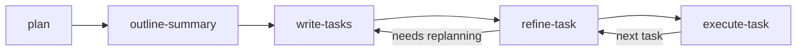

# Kevin's Okay Workflow

A deliberate, phased workflow for complex software initiatives where thinking through the problem is just as important as writing the code.  

This focuses heavily on planning and refinements, leading to very precise execution plans optimized for cold-start.    
Resulting task specs and their cross-references are entirely self-contained.  

This approach supports parallel execution with no platform dependencies - just markdown and an opinionated directory structure.  

## The Problem This Solves

Large initiatives fail when we rush to implementation before understanding the terrain. You've seen it: someone spins up Claude Code, asks for a feature, and twenty minutes later you have half-baked code scattered across the codebase with no coherent plan.

This plugin enforces a different approach: collaborative planning followed by methodical execution. The agent acts as a staff engineer, not a code generator. You build context together, document decisions, break work into discrete tasks, and then execute with clarity.

## Philosophy

**Slow down to speed up.** The fifteen minutes spent asking "why are we doing this?" and "what could go wrong?" saves hours of rewrites and debugging. Good planning compounds.

**Cold-start friendly artifacts.** Every document is written as if someone—or some future conversation thread—will pick it up without context. No "you had to be there" moments. The planning artifacts are dense with information: problem statements, current state analysis, architectural diagrams, and explicit decisions.

**Staff engineer perspective.** The agent doesn't wait for instructions. It asks probing questions, challenges assumptions, surfaces edge cases, and pushes for specifics. You're collaborating with a technical peer who's read the codebase.

## How It Works

The workflow progresses through five skills, each producing artifacts that feed into the next:



### The Five Skills

#### 1. `plan` — Context-Building Conversation

**Invoke:** `/kevins-okay-workflow:plan [initiative-name]`

An open-ended conversation where the agent takes a staff engineer role. No code gets written. Instead, you discuss:

- What problem are we solving? Why does it matter?
- What exists today? Where are the pain points?
- What should be different after this work?
- What constraints are we working under?
- What could go wrong?

The agent will read relevant code, ask clarifying questions, and challenge vague requirements. This phase ends when you both have a shared mental model.

**Produces:** Nothing on disk yet—just shared understanding.

#### 2. `outline-summary` — Planning Artifacts

**Invoke:** `/kevins-okay-workflow:outline-summary [initiative-name]`

The agent synthesizes the planning conversation into two documents:

- **`summary.md`** — Problem statement, current/desired state, key findings, pivots, constraints, risks, open questions
- **`state-diagram.md`** — Before/after mermaid diagrams showing the architectural or behavioral change

These artifacts are written for someone who wasn't in the conversation. They establish the "why" behind all subsequent work.

**Produces:** `.claude/plans/[initiative-name]/summary.md` and `state-diagram.md`

#### 3. `write-tasks` — Execution Plan

**Invoke:** `/kevins-okay-workflow:write-tasks [initiative-name]`

The agent reads your planning artifacts and breaks the work into discrete, sequenced tasks. Each task gets its own markdown file with:

- Objective and context
- Dependencies (what must complete first)
- Scope boundaries (what's in, what's explicitly out)
- High-level approach
- Acceptance criteria
- Key files and locations
- Open questions

Tasks are sized for a single focused session (2-4 hours). The agent also creates an INDEX with a dependency graph and parallelization opportunities.

**Produces:** `.claude/plans/[initiative-name]/tasks/INDEX.md` and individual task files (`01-task-name.md`, `02-task-name.md`, etc.)

#### 4. `refine-task` — Implementation Details

**Invoke:** `/kevins-okay-workflow:refine-task [task-number]`

Pick a task and collaborate with the agent to add execution-level detail:

- Step-by-step implementation approach
- Specific code changes by file
- Testing strategy
- Rollback plan
- Trade-offs and alternatives considered

This is still a conversation, not execution. You're deciding *how* to do the work before doing it. The refined task file becomes a detailed specification that anyone could execute.

**Produces:** Updates the task file with implementation sections.

#### 5. `execute-task` — Do the Work

**Invoke:** `/kevins-okay-workflow:execute-task [task-number]`

Finally, code gets written. The agent follows the refined task specification:

- Implements each step
- Writes/updates tests
- Documents deviations from the plan
- Notes follow-up work
- Updates task status to `complete` or `blocked`

If something unexpected happens, the agent documents it. If a blocker emerges, execution stops and you revisit refinement or planning.

**Produces:** Actual code changes and an updated task file with execution notes.

## Artifact Structure

All planning materials live in `.claude/plans/[initiative-name]/`:

```
.claude/plans/my-initiative/
├── summary.md              # Planning conversation synthesis
├── state-diagram.md        # Before/after architecture diagrams
└── tasks/
    ├── INDEX.md            # Task overview and dependency graph
    ├── 01-first-task.md    # Individual task specs
    ├── 02-second-task.md
    └── ...
```

Each artifact is self-contained. You can share a task file with a teammate, or return to an initiative months later, and the context is preserved.

## Installation

### During Development

```bash
claude --plugin-dir /Users/kard/Workspaces/github.com/therealkevinard/claude-marketplace/plugins/kevins-okay-workflow
```

### For a Project

```bash
claude plugin install /Users/kard/Workspaces/github.com/therealkevinard/claude-marketplace/plugins/kevins-okay-workflow --scope project
```

### For Personal Use

```bash
# Copy to your personal plugins directory
cp -r /Users/kard/Workspaces/github.com/therealkevinard/claude-marketplace/plugins/kevins-okay-workflow ~/.claude/plugins/
```

## When to Use This

This workflow shines for initiatives where:

- The problem space is complex or poorly understood
- Multiple components interact in non-obvious ways
- You need buy-in or shared understanding across a team
- The cost of rework exceeds the cost of planning
- You're working iteratively and need to preserve context across sessions

It's overkill for trivial changes. If you can describe the work in three sentences and it touches one file, just write the damn code.

## Task Status Values

Tasks progress through these states:

| Status | Meaning |
|--------|---------|
| `pending` | Not started, may have unmet dependencies |
| `in-progress` | Currently being worked on |
| `blocked` | Cannot proceed, blocker documented in task file |
| `complete` | Done, acceptance criteria met |

## Conventions

The plugin follows strict naming conventions to maintain consistency:

- **Initiative folders:** lowercase kebab-case (`auth-refactor`, `api-v2-migration`)
- **Task files:** Zero-padded sequence numbers with short descriptions (`01-setup-interfaces.md`)
- **Task descriptions:** lowercase kebab-case, 3-4 words max

See `_conventions.md` in the plugin directory for complete details.

## What Makes This Different

Most workflows treat planning as optional and documentation as an afterthought. This workflow inverts that: artifacts are first-class outputs. The code is almost a side effect.

The agent's role shifts across phases. During planning, it's a skeptical collaborator asking hard questions. During task writing, it's an architect decomposing complexity. During execution, it's a disciplined implementer following the spec.

Context never degrades. A refined task file contains the problem statement, architectural context, implementation details, and test strategy. Pick up any task in a fresh session and you have everything you need.

## License

MIT
